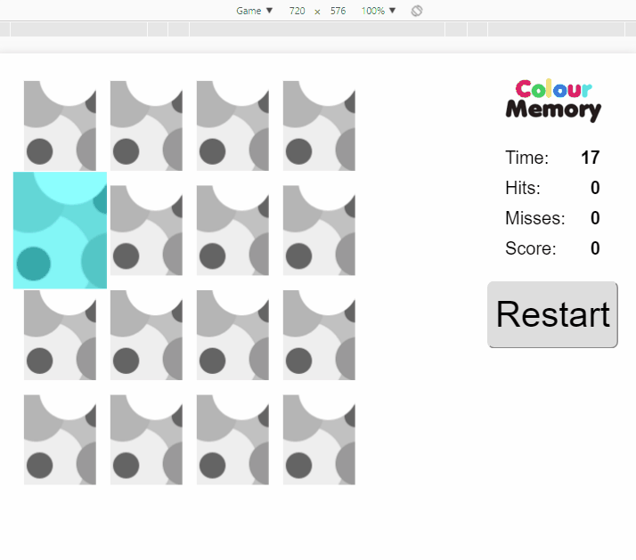

## Synopsis

Live version of the game is accessible at http://bc91f8b8.ngrok.io/scores/

This game is called _Colour Memory_ and consists of a game board. 

The game board consists of a 4x4 grid, all in all 16 slots. All slots consists of cards face-down. The player flips two of these upwards each round, trying to find equals. If the two cards are equal, the player receives one point, and the cards are removed from the game board. Otherwise, the player loses one point and the cards are turned face-down again. This continues until all pairs have been found.

After the game is finished, the user can input his/her name and email. User's details and the scores would then be submitted to the DJango backend and the user would get notified with the high scores and his position in score rankings. 

## Code Example

The backend is a Django application and the frontend is made purely of React.js and with jQuery used to handle only the Ajax requests to the backend. 

## Installation

Since this application is hosted as a single DJango application to install it on a machine follow the steps below
- `git clone https://github.com/virajranjankumar/ColorMemory.git`
- `cd ColorMemory`
- `pip install -r requirements.txt`
- `python manage.py makemigrations`
- `python manage.py migrate`
- `python manage.py runserver 0.0.0.0:8000`

Go to link http://localhost:8000/scores/ to start interacting with the game

## API Reference

The front end consists of React components which are modularly assembled to make the game
The backend is made with DJango and it interfaces to a SQLLite database which stores the user profile and score
The complete application is hosted as an individual django web application with 3 endpoints:

scores/ - for the main index file which shows the game
scores/create/ - for API access to store the user details and score

## Contributors

If you find bugs or errors in this project please file an issue

## License

MIT
